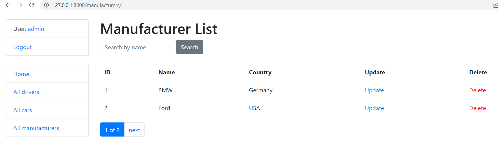

# Taxi service

Django project for taxi service

[Taxi service project deployed to Heroku](https://taxi-service-lasko.herokuapp.com/)

## Installation

Python3 must be installed

```shell
git clone https://github.com/LaskoA/taxi-service-for-deployment
cd taxi-service-for-deployment

Virtual environment install for Windows:
  - python3 -m venv venv
  - source venv/bin/activate
  - pip install -r requirements.txt
  
Virtual environment install for Mac:
  - sudo pip install virtualenv
  - virtualenv env
  - source env/bin/activate
  
python manage.py runserver
python manage.py makemigrations
python manage.py migrate
```

## Features

- list of Drivers, Cars and Manufacturers
- ability to add, modify delete Drivers (Users)
- possibility to vied detailed information on each page


## Demo


## Access
user for test: admin_for_test

password for test: visitor12345


